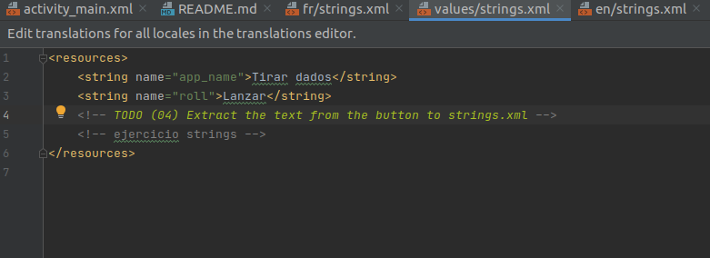
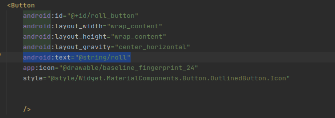
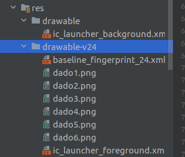
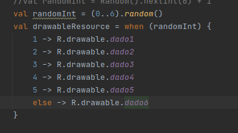
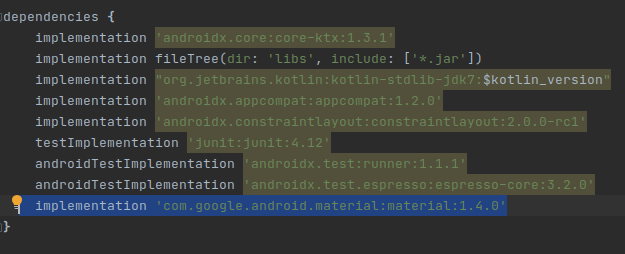
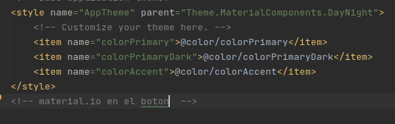
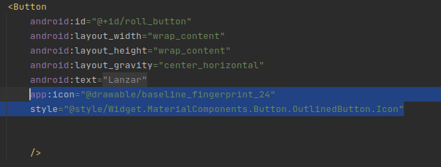
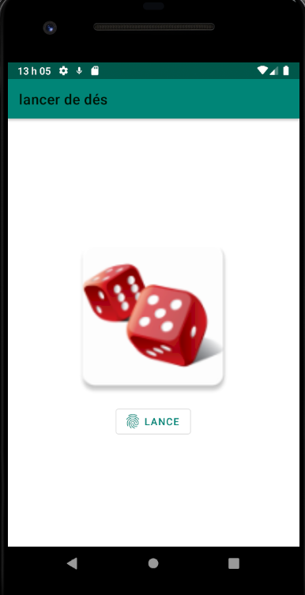
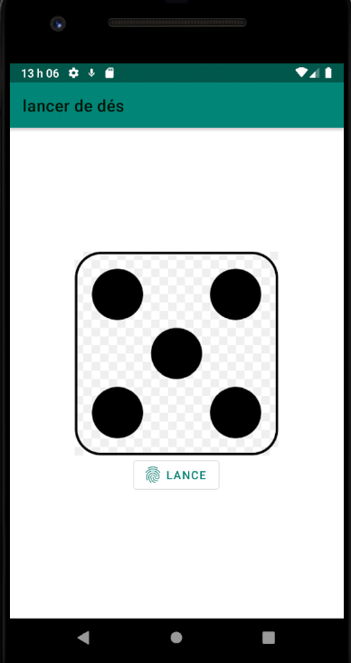

# Dice Roller

Esta es mi aplicacion de lanzador de dados

## **Pasos que hay que hacer**

### 1. Utilizar strings.xml segun idomas
- Aqui ponemos el nombre de la aplicacción y el nombre del boton

### 2. Cambiar Strings layout
- En texto lo que hacemos es envez de poner directamente el texto ponemos la id del texto en los strings
  

### 3. Cambiar las imagenes en el drawable

### 4. Cambiar la función random por algo similar
- Cambie la función random que tenia por la función random de kotlin
  

### 5. Modificar el boton para usar material.io y que tenga asociado un icono
- Primero implementamos las dependencias y sincronizamos
  

- Despues en style ponemos el tema que queramos
  

- Por ultimo descargamos un icono, y en el boton ponemos el icono y estilo que queramos
  

## Imagenes del juego final

